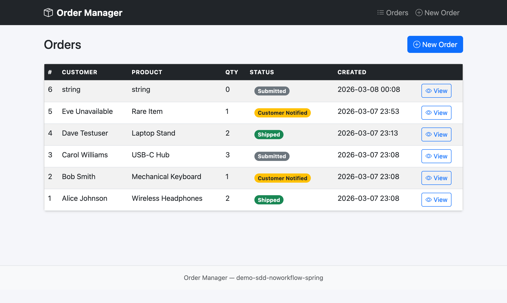
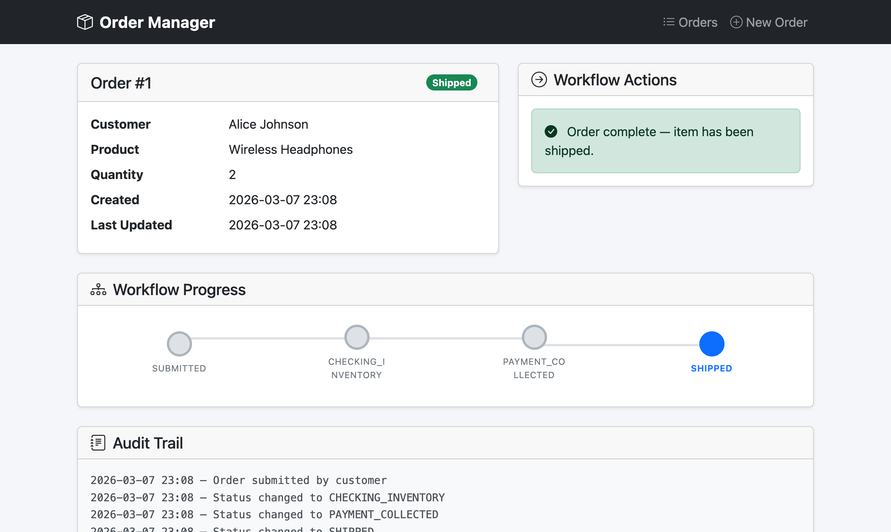

# demo-sdd-noworkflow-spring

> A Specification-Driven Development (SDD) demo implementing an order processing workflow as a Spring Boot web application — **without any external workflow engine**.

---

## Overview

This project demonstrates how a well-defined business process can be implemented using a simple `switch` statement in a service class, rather than a heavyweight workflow engine (Camunda, Flowable, etc.). It follows the **Bestellabwicklung (Order Processing)** workflow from GitHub Issue [#7](https://github.com/lofidewanto/java-ai-simple-demos/issues/7) and was built according to Issue [#10](https://github.com/lofidewanto/java-ai-simple-demos/issues/10).

The application is a full-stack Spring Boot web app with:
- **Web UI** — Thymeleaf templates with Bootstrap 5.3
- **REST API** — Springdoc OpenAPI (Swagger UI)
- **Persistence** — Spring Data JPA + H2 in-memory database
- **Schema migrations** — Flyway

---

## Build Time & Cost

| Phase | Duration | AI Used | Notes |
|-------|----------|---------|-------|
| (1) Write and make US | 30 min | ChatGPT | — |
| (2) Finetuning tasks plan + implement | 35 min | Claude 4.6 + Opus 4.6 | with reviews |
| (3) E2E Test with MCP Server | 95 min | big-pickle / OpenZen | better to use big-pickle free OpenZen |
| **Total** | **2h 40min** | — | — |
| **Total token cost** | — | — | **$1.30 USD** |

---

## State Machine

```
┌────────────┐   CHECK_INVENTORY    ┌─────────────────────┐
│  SUBMITTED │ ─────────────────►  │ CHECKING_INVENTORY  │
└────────────┘                      └──────────┬──────────┘
                                                 │
                            ┌─────────────────────┼─────────────────────┐
                            │                     │                     │
                   MARK_AVAILABLE          MARK_UNAVAILABLE            │
                            ▼                     ▼                     ▼
               ┌──────────────────┐   ┌─────────────────────┐         │
               │ PAYMENT_COLLECTED│   │  CUSTOMER_NOTIFIED  │         │
               └────────┬─────────┘   │      (terminal)     │         │
                        │             └─────────────────────┘         │
                        ▼                                                    │
               ┌───────────────┐                                          │
               │    SHIPPED    │──────────────────────────────────────────┘
               │   (terminal)  │
               └───────────────┘
```

- **5 states**: `SUBMITTED`, `CHECKING_INVENTORY`, `PAYMENT_COLLECTED`, `SHIPPED`, `CUSTOMER_NOTIFIED`
- **2 terminal states**: `SHIPPED` (happy path), `CUSTOMER_NOTIFIED` (item unavailable)
- **Automatic audit trail**: every transition appends a timestamped entry to the `notes` field

---

## Screenshots

### Order List Page



### Order Detail Page (with Workflow Stepper + Audit Trail)



---

## Tech Stack

| Concern | Technology | Version |
|---------|------------|---------|
| Language | Java | 21 |
| Framework | Spring Boot | 3.5.11 |
| Web | Spring Web (embedded Tomcat) | — |
| Templating | Thymeleaf | — |
| Persistence | Spring Data JPA / Hibernate | — |
| Database | H2 (in-memory) | — |
| Migrations | Flyway | — |
| API Docs | Springdoc OpenAPI | 2.8.16 |
| Frontend | Bootstrap 5.3 + Bootstrap Icons | CDN |
| Build | Maven wrapper (`mvnw`) | 3.x |
| Testing | JUnit 5, Mockito, MockMvc | — |

---

## Architecture

```
┌─────────────────────────────────────────────────────────┐
│                    PRESENTATION LAYER                   │
│  OrderWebController   ← Thymeleaf UI (browser)         │
│  OrderApiController   ← REST API (JSON)                │
└───────────────────────┬─────────────────────────────────┘
                        │
┌───────────────────────▼─────────────────────────────────┐
│                     SERVICE LAYER                       │
│  OrderService — contains the state machine switch       │
└───────────────────────┬─────────────────────────────────┘
                        │
┌───────────────────────▼─────────────────────────────────┐
│                  DATA ACCESS LAYER                      │
│  OrderRepository (JpaRepository)                         │
└───────────────────────┬─────────────────────────────────┘
                        │
┌───────────────────────▼─────────────────────────────────┐
│                   DOMAIN LAYER                          │
│  Order entity, OrderStatus enum, H2 + Flyway            │
└─────────────────────────────────────────────────────────┘
```

---

## Getting Started

### Prerequisites
- JDK 21+

### Run the Application

```bash
./mvnw spring-boot:run
```

The application starts on **http://localhost:8080**

### Accessible URLs

| URL | Description |
|-----|-------------|
| `http://localhost:8080/` | Redirects to `/orders` |
| `http://localhost:8080/orders` | Order list (web UI) |
| `http://localhost:8080/orders/new` | Create new order |
| `http://localhost:8080/orders/{id}` | Order detail + workflow actions |
| `http://localhost:8080/api/orders` | REST API — list all orders |
| `http://localhost:8080/api/orders/{id}` | REST API — single order |
| `http://localhost:8080/swagger-ui.html` | Swagger UI |
| `http://localhost:8080/h2-console` | H2 console (JDBC: `jdbc:h2:mem:orderdb`, user: `sa`) |

### Other Commands

```bash
# Run tests (32 tests, all passing)
./mvnw test

# Package (skip tests)
./mvnw package -DskipTests

# Run packaged JAR
java -jar target/demo-sdd-noworkflow-spring-0.0.1-SNAPSHOT.jar

# Clean
./mvnw clean
```

---

## REST API

| Method | Path | Description |
|--------|------|-------------|
| `GET` | `/api/orders` | List all orders (newest first) |
| `GET` | `/api/orders/{id}` | Get single order by ID |
| `POST` | `/api/orders` | Create new order |
| `POST` | `/api/orders/{id}/transition` | Advance workflow state (`{"action":"CHECK_INVENTORY"}`) |

Example — advance an order:

```bash
curl -X POST http://localhost:8080/api/orders/1/transition \
  -H "Content-Type: application/json" \
  -d '{"action":"CHECK_INVENTORY"}'
```

---

## Running Tests

```
Tests run: 32, Failures: 0, Errors: 0, Skipped: 0
BUILD SUCCESS
```

| Test Class | Tests | Type |
|------------|-------|------|
| `DemoSddNoworkflowSpringApplicationTests` | 1 | Integration |
| `OrderServiceTest` | 11 | Unit |
| `OrderRepositoryTest` | 5 | JPA Slice |
| `OrderApiControllerTest` | 8 | Web Slice |
| `OrderWebControllerTest` | 7 | Web Slice |

---

## Project Structure

```
demo-sdd-noworkflow-spring/
├── pom.xml
├── mvnw / mvnw.cmd
│
├── specs/                        # 8 SDD specification documents
│   ├── 01-system-overview.md
│   ├── 02-domain-model.md
│   ├── 03-api-spec.md
│   ├── 04-service-layer.md
│   ├── 05-data-layer.md
│   ├── 06-web-ui-mvc.md
│   ├── 07-testing-strategy.md
│   └── 08-configuration-deployment.md
│
├── userstories/
│   ├── us-10-order-processing-task-plan.md
│   └── us-10-order-processing-e2e-results.md
│
├── docs/screenshots/
│   ├── orders-list.png
│   └── order-detail.png
│
└── src/
    ├── main/
    │   ├── java/com/example/demo/
    │   │   ├── DemoSddNoworkflowSpringApplication.java
    │   │   ├── config/DataInitializer.java
    │   │   ├── model/Order.java, OrderStatus.java
    │   │   ├── repository/OrderRepository.java
    │   │   ├── service/OrderService.java
    │   │   └── controller/api/, web/
    │   └── resources/
    │       ├── application.properties
    │       ├── db/migration/V1__Create_orders_table.sql
    │       ├── static/css/style.css
    │       └── templates/
    └── test/java/com/example/demo/
        └── ... (5 test classes)
```

---

## Design Decisions

1. **No workflow engine** — the state machine lives as a `switch` statement in `OrderService.transitionOrder()`. Simple, debuggable, no external dependencies.

2. **Audit trail in `notes` field** — timestamped entries (`yyyy-MM-dd HH:mm — <message>`) are appended as newline-delimited text. Displayed in a monospace block on the detail page.

3. **Flyway owns schema** — `spring.jpa.hibernate.ddl-auto=validate`. Hibernate never creates tables; Flyway migration defines the schema.

4. **PRG pattern** — all web form POSTs redirect (Post-Redirect-Get) to prevent duplicate submissions.

5. **Seed data on startup** — `DataInitializer` creates 3 orders (Alice=SHIPPED, Bob=CUSTOMER_NOTIFIED, Carol=SUBMITTED) so the UI is immediately demonstrable.

6. **`@MockitoBean`** — Spring Boot 3.x uses `@MockitoBean` (from `org.springframework.test.context.bean.override.mockito`) instead of the deprecated `@MockBean`.

---

## License

MIT
