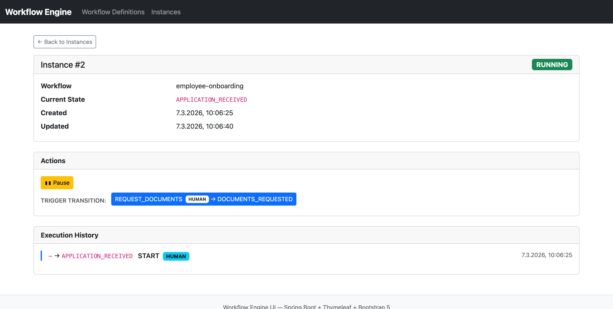

# Workflow Engine — Spring Boot


A lightweight, embedded workflow engine built on standard Spring Boot components. Define multi-step business processes as YAML files and execute them via REST API or a browser-based UI — no external workflow runtime required.

## Features

- Load workflow definitions from YAML files at startup
- Start and drive workflow instances through transitions via REST
- Persist instance state and full transition history (JPA + H2 + Flyway)
- Reject invalid and illegal transitions with descriptive error responses
- Pause and resume running instances
- Web UI (Thymeleaf + Bootstrap 5) served at `/ui`
- Interactive API docs via Swagger UI
- Three bundled example workflows (order processing, employee onboarding, support ticket)

## Tech Stack

| Component | Technology |
|-----------|-----------|
| Language | Java 21 |
| Framework | Spring Boot 3.5.11 |
| Persistence | Spring Data JPA, H2 (in-memory), Flyway |
| Web UI | Thymeleaf, Bootstrap 5, vanilla JS fetch |
| API Docs | SpringDoc OpenAPI / Swagger UI |
| Build | Maven (Maven Wrapper included) |
| Testing | JUnit 5, Spring Boot Test, MockMvc |

## Quick Start

### Prerequisites

- Java 21+
- Maven 3.6+ (or use the included `./mvnw` wrapper)

### Build and Run

```bash
git clone https://github.com/lofidewanto/java-ai-simple-demos.git
cd java-ai-simple-demos/demo-sdd-workflow-spring
./mvnw spring-boot:run
```

### Access Points

| URL | Description |
|-----|-------------|
| `http://localhost:8080/ui` | Web UI (redirects to `/ui/workflows`) |
| `http://localhost:8080/api/workflow-definitions` | REST — list all definitions |
| `http://localhost:8080/api/workflow-instances` | REST — list / create instances |
| `http://localhost:8080/swagger-ui.html` | Swagger UI (interactive API docs) |
| `http://localhost:8080/h2-console` | H2 in-memory database console |

## Web UI



| Page | URL | Description |
|------|-----|-------------|
| Workflow Definitions | `/ui/workflows` | List all definitions; start new instances |
| Instances | `/ui/instances` | List all instances with status badges |
| Instance Detail | `/ui/instances/{id}` | Full transition history; action buttons to drive the workflow |

## Example Workflows

Three YAML workflows are bundled under `src/main/resources/workflows/`:

| File | Name | States | Transitions |
|------|------|--------|-------------|
| `order-processing.yml` | `order-processing` | 5 (2 terminal) | 4 |
| `employee-onboarding.yml` | `employee-onboarding` | 7 (2 terminal) | 7 |
| `support-ticket.yml` | `support-ticket` | 6 (1 terminal) | 7 |

## REST API

### Workflow Definitions

| Method | Path | Description |
|--------|------|-------------|
| `GET` | `/api/workflow-definitions` | List all definitions |
| `GET` | `/api/workflow-definitions/{name}` | Get a single definition by name |

### Workflow Instances

| Method | Path | Description |
|--------|------|-------------|
| `POST` | `/api/workflow-instances` | Start a new instance (`{"workflowName": "order-processing"}`) |
| `GET` | `/api/workflow-instances` | List all instances (optional `?workflowName=` filter) |
| `GET` | `/api/workflow-instances/{id}` | Get a single instance with full history |
| `POST` | `/api/workflow-instances/{id}/transitions` | Trigger a transition (`{"action": "SUBMIT_ORDER"}`) |
| `GET` | `/api/workflow-instances/{id}/history` | Get transition history only |
| `POST` | `/api/workflow-instances/{id}/pause` | Pause a running instance |
| `POST` | `/api/workflow-instances/{id}/resume` | Resume a paused instance |

### Error Responses

All errors return a consistent JSON body:

```json
{
  "error": "INVALID_TRANSITION",
  "message": "No transition found for action 'SHIP_ORDER' in state 'NEW'",
  "timestamp": "2026-03-07T10:01:00"
}
```

| Scenario | HTTP Status | `error` value |
|----------|-------------|---------------|
| Definition not found | 404 | `WORKFLOW_NOT_FOUND` |
| Instance not found | 404 | `INSTANCE_NOT_FOUND` |
| Invalid action for current state | 422 | `INVALID_TRANSITION` |
| Instance already in terminal state | 422 | `WORKFLOW_COMPLETED` |
| Transition attempted on paused instance | 422 | `WORKFLOW_PAUSED` |
| Instance not RUNNING (for pause) | 422 | `WORKFLOW_NOT_RUNNING` |
| Instance not PAUSED (for resume) | 422 | `WORKFLOW_NOT_PAUSED` |
| Request body validation failure | 400 | `VALIDATION_ERROR` |

## Workflow YAML DSL

Place `.yml` files in `src/main/resources/workflows/` and restart — the loader picks them up automatically.

```yaml
name: order-processing
description: "Bestellabwicklung — Manages the full order lifecycle"
source: "https://github.com/lofidewanto/java-ai-simple-demos/issues/7"

states:
  - name: NEW
    initial: true
    description: "Neue Bestellung eingegangen"
  - name: CHECKING_AVAILABILITY
    description: "Verfügbarkeit wird geprüft"
  - name: PAYMENT_PENDING
    description: "Zahlung ausstehend"
  - name: SHIPPED
    terminal: true
    description: "Bestellung versendet"
  - name: CANCELLED
    terminal: true
    description: "Bestellung storniert"

transitions:
  - from: NEW
    to: CHECKING_AVAILABILITY
    action: SUBMIT_ORDER
    taskType: HUMAN
  - from: CHECKING_AVAILABILITY
    to: PAYMENT_PENDING
    action: STOCK_AVAILABLE
    taskType: GATEWAY
  - from: CHECKING_AVAILABILITY
    to: CANCELLED
    action: STOCK_UNAVAILABLE
    taskType: GATEWAY
  - from: PAYMENT_PENDING
    to: SHIPPED
    action: PAYMENT_COLLECTED
    taskType: SERVICE
```

### TaskType Values

| Value | Meaning |
|-------|---------|
| `HUMAN` | A human actor performs the step (default) |
| `SERVICE` | An automated service or integration |
| `GATEWAY` | A conditional routing decision |
| `EVENT` | An external event triggers the transition |

## Project Structure

```
demo-sdd-workflow-spring/
├── docs/
│   └── ui-screenshot.png
├── specs/                          # Specification documents
│   ├── 01-system-overview.md
│   ├── 02-domain-model.md
│   ├── 03-api-spec.md
│   ├── 04-service-layer.md
│   ├── 05-data-layer.md
│   ├── 06-workflow-dsl.md
│   ├── 07-testing-strategy.md
│   ├── 08-configuration-deployment.md
│   └── 09-ui-layer.md
├── userstories/                    # Implementation plans with test results
│   ├── US-008-backend-workflow-engine.md
│   └── US-009-workflow-ui.md
└── src/
    ├── main/
    │   ├── java/com/example/workflow/
    │   │   ├── config/
    │   │   ├── controller/
    │   │   ├── domain/
    │   │   ├── dto/
    │   │   ├── exception/
    │   │   ├── repository/
    │   │   └── service/
    │   └── resources/
    │       ├── templates/          # Thymeleaf templates
    │       ├── workflows/          # YAML workflow definitions
    │       ├── db/migration/       # Flyway SQL migrations
    │       └── application.properties
    └── test/
```

## Documentation

### Specification

| Document | Description |
|----------|-------------|
| [01 — System Overview](specs/01-system-overview.md) | Purpose, scope, key concepts, component diagram |
| [02 — Domain Model](specs/02-domain-model.md) | JPA entities and relationships |
| [03 — API Specification](specs/03-api-spec.md) | Full REST API reference |
| [04 — Service Layer](specs/04-service-layer.md) | Service contracts and business rules |
| [05 — Data Layer](specs/05-data-layer.md) | Repository interfaces and Flyway migrations |
| [06 — Workflow DSL](specs/06-workflow-dsl.md) | YAML format, validation rules, full examples |
| [07 — Testing Strategy](specs/07-testing-strategy.md) | Test categories and coverage requirements |
| [08 — Configuration & Deployment](specs/08-configuration-deployment.md) | Properties, profiles, and deployment notes |
| [09 — UI Layer](specs/09-ui-layer.md) | Thymeleaf templates and UI routes |

### User Stories

| Document | Description |
|----------|-------------|
| [US-008 — Backend Workflow Engine](userstories/US-008-backend-workflow-engine.md) | Implementation plan and test results for the REST backend |
| [US-009 — Workflow UI](userstories/US-009-workflow-ui.md) | Implementation plan and test results for the web UI |

## License

This project is licensed under the [Apache License 2.0](../LICENSE).
