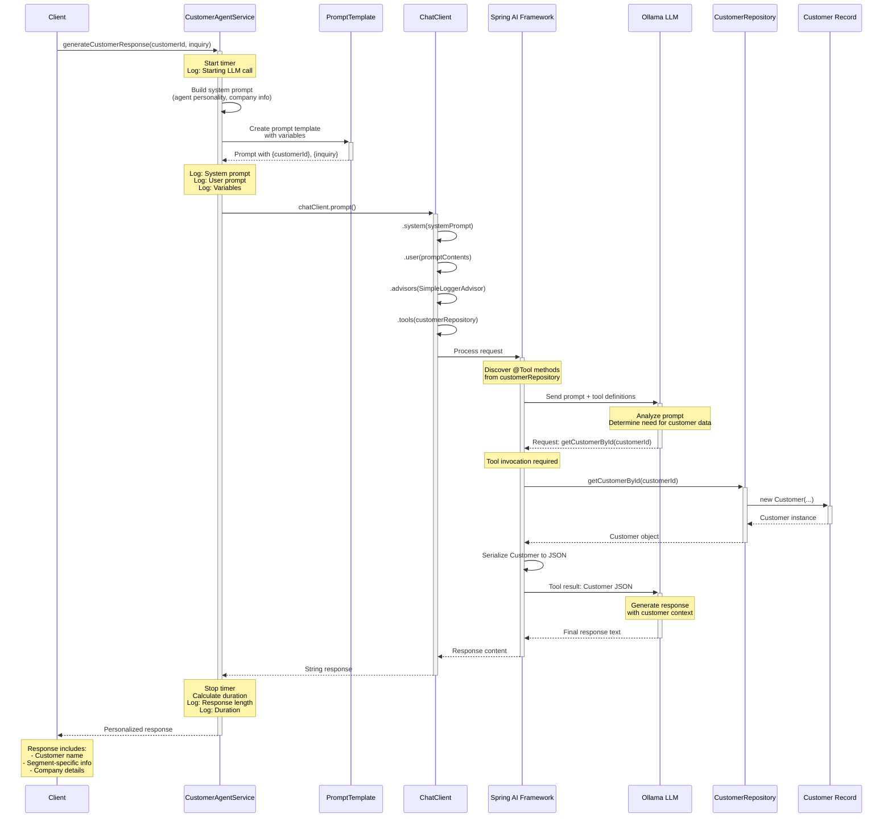

# System Architecture - Customer Agent Service

**Version:** 0.0.1-SNAPSHOT  
**Last Updated:** February 12, 2026  
**Project:** demo-spring-ai  
**Architecture Style:** Layered Service Architecture with AI Integration

---

## Table of Contents

- [Overview](#overview)
- [High-Level Architecture](#high-level-architecture)
- [Component Architecture](#component-architecture)
- [Layer Architecture](#layer-architecture)
- [LLM Interaction Flow](#llm-interaction-flow)
- [Data Flow](#data-flow)
- [Tool Execution Flow](#tool-execution-flow)
- [Spring AI Integration Architecture](#spring-ai-integration-architecture)
- [Bean Configuration and Dependency Injection](#bean-configuration-and-dependency-injection)
- [Design Principles](#design-principles)
- [Scalability Considerations](#scalability-considerations)
- [Security Architecture](#security-architecture)
- [Related Documentation](#related-documentation)

---

## Overview

The Customer Agent Service follows a **layered service architecture** pattern integrated with the **Spring AI framework** for LLM interactions. The system is designed to be:

- **Modular**: Clear separation of concerns across layers
- **Extensible**: Easy to add new tools, models, or features
- **Testable**: Dependency injection enables comprehensive testing
- **Observable**: Comprehensive logging at all layers
- **Maintainable**: Clean code with well-defined responsibilities

### Architectural Style

**Primary Pattern**: Layered Architecture  
**Secondary Patterns**: 
- Repository Pattern (data access)
- Service Layer Pattern (business logic)
- Dependency Injection (loose coupling)
- Builder Pattern (ChatClient API)
- Tool/Strategy Pattern (Spring AI tools)

---

## High-Level Architecture

```
┌─────────────────────────────────────────────────────────────┐
│                     Client/Consumer                          │
│                 (Future REST API / Tests)                    │
└────────────────────────┬────────────────────────────────────┘
                         │
                         ▼
┌─────────────────────────────────────────────────────────────┐
│                   Service Layer                              │
│             CustomerAgentService (@Service)                  │
│  • Orchestrates LLM interactions                            │
│  • Manages prompts and templates                            │
│  • Handles errors and logging                               │
└────────────────────────┬────────────────────────────────────┘
                         │
                         ▼
┌─────────────────────────────────────────────────────────────┐
│                 Spring AI Framework                          │
│                 ChatClient (Bean)                            │
│  • Fluent API for LLM interactions                          │
│  • Tool discovery and invocation                            │
│  • Prompt processing                                        │
│  • Response handling                                        │
└──────────────┬──────────────────────────┬───────────────────┘
               │                          │
               ▼                          ▼
┌──────────────────────────┐  ┌──────────────────────────────┐
│   Repository Layer       │  │    External LLM              │
│CustomerRepository        │  │    Ollama (localhost:11434)  │
│  (@Repository, @Tool)    │  │    Model: gpt-oss:20b        │
│  • Provides customer data│  │                              │
│  • Invoked by LLM        │  │                              │
└──────────┬───────────────┘  └──────────────────────────────┘
           │
           ▼
┌──────────────────────────┐
│    Data Model            │
│    Customer (record)     │
│    • Immutable           │
│    • Thread-safe         │
└──────────────────────────┘
```

---

## Component Architecture

### Component Diagram

```mermaid
graph TB
    subgraph "Spring Boot Application"
        APP[DemoAiApplication<br/>@SpringBootApplication]
        
        subgraph "Bean Configuration"
            CC[ChatClient Bean<br/>Created from OllamaChatModel]
        end
        
        subgraph "Service Layer"
            CAS[CustomerAgentService<br/>@Service]
        end
        
        subgraph "Repository Layer"
            CR[CustomerRepository<br/>@Repository<br/>@Tool]
        end
        
        subgraph "Data Models"
            CUST[Customer<br/>Java Record<br/>Immutable]
        end
    end
    
    subgraph "External Systems"
        OLLAMA[Ollama LLM<br/>localhost:11434<br/>Model: gpt-oss:20b]
    end
    
    subgraph "Spring AI Framework"
        SPRING_AI[Spring AI Core]
        TOOL_DISCOVERY[Tool Discovery<br/>Scans @Tool annotations]
        PROMPT[PromptTemplate<br/>Template Engine]
        ADVISOR[SimpleLoggerAdvisor<br/>Logging Interceptor]
    end
    
    APP -->|Creates & Configures| CC
    APP -->|Component Scan| CAS
    APP -->|Component Scan| CR
    
    CAS -->|Uses| CC
    CAS -->|Creates| PROMPT
    CAS -->|Passes as Tool| CR
    
    CC -->|Communicates with| OLLAMA
    CC -->|Uses| SPRING_AI
    CC -->|Applies| ADVISOR
    
    SPRING_AI -->|Discovers| TOOL_DISCOVERY
    TOOL_DISCOVERY -->|Finds| CR
    
    CR -->|Returns| CUST
    OLLAMA -->|Invokes via Spring AI| CR
    
    CAS -->|Receives| CUST
    
    style APP fill:#e1f5ff
    style CC fill:#fff4e1
    style CAS fill:#e8f5e9
    style CR fill:#f3e5f5
    style CUST fill:#fce4ec
    style OLLAMA fill:#ffebee
    style SPRING_AI fill:#e0f2f1
    style TOOL_DISCOVERY fill:#e0f2f1
    style PROMPT fill:#fff9c4
    style ADVISOR fill:#f1f8e9
```

### Component Descriptions

#### 1. **DemoAiApplication** (`@SpringBootApplication`)

**File**: `src/main/java/com/example/demo/DemoAiApplication.java`

**Responsibilities**:
- Application entry point
- Spring context initialization
- Bean configuration and wiring

**Key Code**:
```java
// DemoAiApplication.java:16-19
@Bean
ChatClient chatClient(OllamaChatModel ollamaChatModel) {
    return ChatClient.create(ollamaChatModel);
}
```

**Dependencies**:
- `OllamaChatModel` (auto-configured by Spring AI)

**Produces**:
- `ChatClient` bean for injection

---

#### 2. **CustomerAgentService** (`@Service`)

**File**: `src/main/java/com/example/demo/CustomerAgentService.java`

**Responsibilities**:
- Orchestrate LLM interactions
- Manage prompt templates
- Handle errors and logging
- Measure performance

**Key Dependencies**:
- `ChatClient` (injected)
- `CustomerRepository` (injected)

**Key Method**:
```java
// CustomerAgentService.java:26
public String generateCustomerResponse(String customerId, String inquiry)
```

**Process Flow**:
1. Build system prompt (agent personality)
2. Build user prompt (with variables)
3. Log request details
4. Invoke ChatClient with tools
5. Receive and log response
6. Handle errors gracefully

---

#### 3. **CustomerRepository** (`@Repository`, `@Tool`)

**File**: `src/main/java/com/example/demo/CustomerRepository.java`

**Responsibilities**:
- Provide customer data
- Act as Spring AI tool
- Interface for LLM to fetch data

**Key Annotations**:
```java
// CustomerRepository.java:8-11
@Repository
public class CustomerRepository {
    @Tool(description = "Get the customer details by customer ID")
    public Customer getCustomerById(String customerId) { ... }
}
```

**Tool Integration**:
- Spring AI discovers this method via `@Tool` annotation
- LLM can invoke this during conversation
- Returns `Customer` object serialized to JSON for LLM

---

#### 4. **Customer** (Java Record)

**File**: `src/main/java/com/example/demo/Customer.java`

**Responsibilities**:
- Immutable data container
- Customer information representation

**Key Features**:
```java
// Customer.java:5-12
public record Customer(
    String id,
    String name,
    String email,
    String phoneNumber,
    String preferredLanguage,
    LocalDateTime lastInteraction,
    String customerSegment) { }
```

**Benefits**:
- Immutable (thread-safe)
- Compact syntax
- Built-in equals/hashCode/toString
- No boilerplate

---

#### 5. **ChatClient** (Spring AI Bean)

**Configuration**: `DemoAiApplication.java:16-19`

**Responsibilities**:
- Fluent API for LLM interactions
- Tool discovery and invocation
- Request/response handling
- Advisor chain management

**Usage Pattern**:
```java
// CustomerAgentService.java:82-88
String response = chatClient.prompt()
    .system(systemPrompt)           // Set system message
    .user(prompt.getContents())     // Set user message
    .advisors(new SimpleLoggerAdvisor())  // Add logging
    .tools(customerRepository)      // Register tools
    .call()                         // Execute
    .content();                     // Extract text
```

---

#### 6. **Spring AI Framework**

**Components**:
- **ChatClient**: Main API interface
- **OllamaChatModel**: Ollama integration
- **ToolDiscovery**: Scans `@Tool` annotations
- **PromptTemplate**: Template engine
- **Advisors**: Interceptor chain

**Auto-Configuration**:
- Spring AI auto-configures `OllamaChatModel` from `application.properties`
- Tool discovery happens at application startup
- Tool metadata is generated from method signatures

---

## Layer Architecture

### Layer Diagram

```
┌───────────────────────────────────────────────────────────┐
│  Presentation Layer (Future REST API)                     │
│  • @RestController                                        │
│  • Request/Response DTOs                                  │
│  • Validation                                             │
└─────────────────────┬─────────────────────────────────────┘
                      │
┌─────────────────────▼─────────────────────────────────────┐
│  Service Layer                                            │
│  • CustomerAgentService (@Service)                        │
│  • Business logic orchestration                           │
│  • Prompt management                                      │
│  • Error handling                                         │
│  • Logging and metrics                                    │
└─────────────────────┬─────────────────────────────────────┘
                      │
┌─────────────────────▼─────────────────────────────────────┐
│  Integration Layer (Spring AI)                            │
│  • ChatClient                                             │
│  • LLM communication                                      │
│  • Tool invocation                                        │
│  • Response parsing                                       │
└──────────┬──────────────────────────────┬─────────────────┘
           │                              │
┌──────────▼───────────────┐   ┌─────────▼─────────────────┐
│  Repository Layer         │   │  External Services        │
│  • CustomerRepository     │   │  • Ollama LLM             │
│  • Data access (@Tool)    │   │  • Model: gpt-oss:20b     │
│  • Mock or DB queries     │   │                           │
└──────────┬───────────────┘   └───────────────────────────┘
           │
┌──────────▼───────────────┐
│  Data Layer              │
│  • Customer (record)     │
│  • Immutable models      │
│  • Value objects         │
└──────────────────────────┘
```

### Layer Responsibilities

| Layer | Components | Responsibilities | Depends On |
|-------|------------|------------------|------------|
| **Presentation** | (Future) REST Controllers | HTTP request/response, validation | Service Layer |
| **Service** | CustomerAgentService | Business logic, orchestration, prompts | Integration Layer, Repository Layer |
| **Integration** | ChatClient, Spring AI | LLM communication, tool invocation | External Services |
| **Repository** | CustomerRepository | Data access, tool implementation | Data Layer |
| **Data** | Customer record | Data models, immutability | None |

### Layer Communication Rules

1. **Downward Dependencies Only**: Each layer can only depend on layers below it
2. **No Skip-Level Dependencies**: Service layer cannot directly access data layer (must go through repository)
3. **Interface-Based**: Layers communicate via interfaces (Spring DI)
4. **Data Transfer**: Use DTOs/records for data transfer between layers

---

## LLM Interaction Flow

### Sequence Diagram



### Flow Description

#### Phase 1: Request Initiation (Lines 1-7)
1. Client calls `CustomerAgentService.generateCustomerResponse()`
2. Service starts performance timer
3. Logs request initiation

#### Phase 2: Prompt Building (Lines 8-13)
4. Service constructs system prompt with agent personality
5. Creates `PromptTemplate` with user prompt
6. Injects variables (`customerId`, `inquiry`)
7. Logs all prompt components

#### Phase 3: ChatClient Invocation (Lines 14-20)
8. Builds ChatClient request using fluent API
9. Chains: system → user → advisors → tools
10. Passes `customerRepository` as tool

#### Phase 4: Spring AI Processing (Lines 21-23)
11. Spring AI scans `@Tool` methods
12. Generates JSON schema for tools
13. Prepares LLM request payload

#### Phase 5: LLM First Call (Lines 24-27)
14. Sends prompt + tool definitions to Ollama
15. LLM analyzes prompt
16. LLM decides to call tool

#### Phase 6: Tool Invocation (Lines 28-36)
17. LLM requests `getCustomerById(customerId)`
18. Spring AI invokes repository method
19. Repository creates Customer record
20. Returns Customer object
21. Spring AI serializes to JSON

#### Phase 7: LLM Second Call (Lines 37-41)
22. Sends tool result back to LLM
23. LLM generates final response with customer context
24. Returns natural language text

#### Phase 8: Response Handling (Lines 42-46)
25. Spring AI returns response to ChatClient
26. ChatClient returns to service
27. Service logs response and duration
28. Returns to client

---

## Data Flow

### Data Flow Diagram

```mermaid
flowchart TD
    START([Client Calls Service]) --> INPUT[Input Data:<br/>- customerId: String<br/>- inquiry: String]
    
    INPUT --> SYS_PROMPT[Build System Prompt<br/>- Agent personality<br/>- Company info<br/>- Instructions]
    
    INPUT --> USER_PROMPT[Build User Prompt<br/>- Customer ID variable<br/>- Inquiry variable<br/>- Template formatting]
    
    SYS_PROMPT --> MERGE[Merge Prompts]
    USER_PROMPT --> MERGE
    
    MERGE --> CHAT_CLIENT[ChatClient API<br/>Fluent builder pattern]
    
    CHAT_CLIENT --> CONFIG[Configure Request:<br/>- system()<br/>- user()<br/>- tools()<br/>- advisors()]
    
    CONFIG --> SPRING_AI[Spring AI Framework<br/>Process & Transform]
    
    SPRING_AI --> TOOL_SCAN[Scan @Tool Annotations<br/>Generate JSON Schema]
    
    TOOL_SCAN --> LLM_REQ[LLM Request Payload:<br/>- System message<br/>- User message<br/>- Tool definitions<br/>- Model params]
    
    LLM_REQ --> OLLAMA[Ollama LLM<br/>Model: gpt-oss:20b]
    
    OLLAMA --> DECISION{LLM Needs<br/>Tool Call?}
    
    DECISION -->|Yes| TOOL_CALL[Tool Call Request:<br/>getCustomerById]
    DECISION -->|No| GENERATE[Generate Response]
    
    TOOL_CALL --> REPO[CustomerRepository<br/>@Tool method]
    
    REPO --> DB_MOCK[Mock Data<br/>or Database Query]
    
    DB_MOCK --> CUST_OBJ[Customer Record:<br/>- id<br/>- name<br/>- email<br/>- phone<br/>- language<br/>- segment<br/>- lastInteraction]
    
    CUST_OBJ --> SERIALIZE[Serialize to JSON]
    
    SERIALIZE --> LLM_CONTEXT[Send to LLM<br/>as tool result]
    
    LLM_CONTEXT --> GENERATE
    
    GENERATE --> LLM_RESP[LLM Response:<br/>Natural language text<br/>with customer context]
    
    LLM_RESP --> SPRING_AI_RESP[Spring AI<br/>Parse & Validate]
    
    SPRING_AI_RESP --> CHAT_RESP[ChatClient<br/>Extract content]
    
    CHAT_RESP --> SERVICE_LOG[Service Layer:<br/>- Log response<br/>- Calculate duration<br/>- Error handling]
    
    SERVICE_LOG --> RETURN[Return String<br/>to Client]
    
    RETURN --> END([End])
    
    style START fill:#e1f5ff
    style INPUT fill:#fff4e1
    style SYS_PROMPT fill:#e8f5e9
    style USER_PROMPT fill:#e8f5e9
    style OLLAMA fill:#ffebee
    style CUST_OBJ fill:#fce4ec
    style RETURN fill:#c8e6c9
    style END fill:#e1f5ff
    style DECISION fill:#fff9c4
```

### Data Transformations

| Stage | Input | Output | Transformation |
|-------|-------|--------|----------------|
| **Service Entry** | `String customerId, String inquiry` | Prompt variables | Extract and package |
| **Prompt Building** | Variables + Templates | System & User messages | Template interpolation |
| **ChatClient** | Messages + Config | LLM request | Builder pattern assembly |
| **Spring AI** | Request + Tools | HTTP payload | JSON serialization |
| **Ollama LLM** | Prompt + Tools | Tool call request | LLM inference |
| **Tool Invocation** | `customerId` | `Customer` object | Repository query |
| **Serialization** | `Customer` object | JSON | Java → JSON |
| **LLM Generation** | Tool result + Prompt | Response text | LLM synthesis |
| **Response Extract** | LLM response | String content | Parse and extract |
| **Service Return** | Response + Metadata | Final string | Logging + return |

---

## Tool Execution Flow

### Tool Execution Diagram

```mermaid
flowchart TD
    START([Application Startup]) --> SCAN[Spring AI<br/>Component Scanning]
    
    SCAN --> FIND_REPO[Find @Repository<br/>Classes]
    
    FIND_REPO --> SCAN_METHODS[Scan Methods for<br/>@Tool Annotation]
    
    SCAN_METHODS --> CHECK{Found @Tool<br/>Methods?}
    
    CHECK -->|No| SKIP[Skip this class]
    CHECK -->|Yes| EXTRACT[Extract Tool Metadata]
    
    EXTRACT --> META[Metadata Extraction:<br/>- Method name<br/>- Description<br/>- Parameters<br/>- Return type]
    
    META --> SCHEMA[Generate JSON Schema:<br/>- Function name<br/>- Description<br/>- Parameters schema<br/>- Required fields]
    
    SCHEMA --> REGISTER[Register Tool<br/>in Spring AI Registry]
    
    REGISTER --> READY[Tool Ready<br/>for LLM Invocation]
    
    READY --> RUNTIME([Runtime Execution])
    
    RUNTIME --> LLM_CALL[LLM Receives<br/>Tool Definitions]
    
    LLM_CALL --> LLM_DECIDE{LLM Decides<br/>to Call Tool?}
    
    LLM_DECIDE -->|No| DIRECT_RESP[Generate Response<br/>Without Tool]
    LLM_DECIDE -->|Yes| TOOL_REQ[LLM Sends<br/>Tool Call Request]
    
    TOOL_REQ --> PARSE[Spring AI Parses:<br/>- Tool name<br/>- Arguments]
    
    PARSE --> MATCH[Match Tool Name<br/>to Registered Method]
    
    MATCH --> VALIDATE[Validate Arguments<br/>Against Schema]
    
    VALIDATE --> VALID{Valid?}
    
    VALID -->|No| ERROR[Return Error<br/>to LLM]
    VALID -->|Yes| DESERIALIZE[Deserialize Arguments<br/>to Java Types]
    
    DESERIALIZE --> INVOKE[Invoke Java Method<br/>via Reflection]
    
    INVOKE --> EXAMPLE["Example:<br/>customerRepository<br/>.getCustomerById(customerId)"]
    
    EXAMPLE --> EXECUTE[Execute Method Logic]
    
    EXECUTE --> RETURN_VAL[Method Returns<br/>Customer Object]
    
    RETURN_VAL --> SER[Serialize Result<br/>to JSON]
    
    SER --> SEND_LLM[Send Tool Result<br/>to LLM]
    
    SEND_LLM --> LLM_PROCESS[LLM Processes<br/>Tool Result]
    
    LLM_PROCESS --> LLM_DECIDE
    
    DIRECT_RESP --> FINAL[Final Response]
    ERROR --> FINAL
    
    FINAL --> END([End])
    
    style START fill:#e1f5ff
    style SCAN fill:#fff4e1
    style EXTRACT fill:#e8f5e9
    style SCHEMA fill:#f3e5f5
    style REGISTER fill:#c8e6c9
    style LLM_DECIDE fill:#fff9c4
    style INVOKE fill:#ffebee
    style EXAMPLE fill:#fce4ec
    style RETURN_VAL fill:#fce4ec
    style ERROR fill:#ffcdd2
    style FINAL fill:#c8e6c9
    style END fill:#e1f5ff
```



### Tool Registration Process (Startup)

1. **Component Scanning**: Spring AI scans all Spring beans
2. **Find @Repository**: Identifies repository classes
3. **Scan Methods**: Looks for `@Tool` annotated methods
4. **Extract Metadata**: 
   - Method name: `getCustomerById`
   - Description: "Get the customer details by customer ID"
   - Parameters: `String customerId`
   - Return type: `Customer`
5. **Generate JSON Schema**:
```json
{
  "name": "getCustomerById",
  "description": "Get the customer details by customer ID",
  "parameters": {
    "type": "object",
    "properties": {
      "customerId": {
        "type": "string"
      }
    },
    "required": ["customerId"]
  }
}
```
6. **Register**: Store in Spring AI tool registry

### Tool Invocation Process (Runtime)

1. **LLM Receives Tools**: Tool definitions sent with every prompt
2. **LLM Decision**: Model decides whether to call tool
3. **Tool Request**: If yes, sends tool name + arguments
4. **Parse Request**: Spring AI extracts tool call details
5. **Match Method**: Find registered method by name
6. **Validate**: Check arguments against schema
7. **Deserialize**: Convert JSON to Java types
8. **Invoke**: Call method via reflection
9. **Execute**: Run business logic
10. **Serialize**: Convert result to JSON
11. **Send to LLM**: Return tool result
12. **LLM Process**: Generate final response with context

---

## Spring AI Integration Architecture

### Integration Components

```
┌─────────────────────────────────────────────────────────┐
│                 Spring AI Framework                      │
│                                                          │
│  ┌────────────────────────────────────────────────────┐ │
│  │            Auto-Configuration                      │ │
│  │  • OllamaChatModel (from properties)              │ │
│  │  • ChatClient.Builder                             │ │
│  │  • Tool discovery                                 │ │
│  └────────────────────────────────────────────────────┘ │
│                                                          │
│  ┌────────────────────────────────────────────────────┐ │
│  │              Core Components                       │ │
│  │  • ChatClient: Fluent API                         │ │
│  │  • PromptTemplate: Template engine                │ │
│  │  • Advisors: Interceptor chain                    │ │
│  │  • Tool Registry: Function calling                │ │
│  └────────────────────────────────────────────────────┘ │
│                                                          │
│  ┌────────────────────────────────────────────────────┐ │
│  │          Ollama Integration                        │ │
│  │  • HTTP client for Ollama API                     │ │
│  │  • Request/response serialization                 │ │
│  │  • Streaming support                              │ │
│  │  • Error handling                                 │ │
│  └────────────────────────────────────────────────────┘ │
└─────────────────────────────────────────────────────────┘
```

### Configuration Flow

```
application.properties
         ↓
Spring Boot Auto-Configuration
         ↓
OllamaChatModel Bean
         ↓
DemoAiApplication.chatClient() Bean
         ↓
Injected into CustomerAgentService
         ↓
Used for LLM interactions
```

### Key Integration Points

1. **Property Configuration**: `application.properties` → Auto-configuration
2. **Bean Creation**: `OllamaChatModel` → `ChatClient` bean
3. **Dependency Injection**: `ChatClient` → `CustomerAgentService`
4. **Tool Discovery**: `@Tool` methods → Tool registry
5. **Runtime Invocation**: ChatClient API → Ollama HTTP API

---

## Bean Configuration and Dependency Injection

### Bean Dependency Graph

```
OllamaChatModel (auto-configured)
    ↓
ChatClient (manual bean)
    ↓
CustomerAgentService
    ↓
CustomerRepository
    ↓
Customer (returned)
```

### Bean Definitions

#### 1. **OllamaChatModel** (Auto-Configured)

**Source**: Spring AI Auto-Configuration  
**Configuration**: `application.properties`

```properties
spring.ai.ollama.base-url=http://localhost:11434
spring.ai.ollama.chat.options.model=gpt-oss:20b
spring.ai.ollama.chat.options.temperature=0.7
```

**Lifecycle**: Singleton  
**Created**: Application startup  

#### 2. **ChatClient** (Manual Bean)

**Source**: `DemoAiApplication.java:16-19`

```java
@Bean
ChatClient chatClient(OllamaChatModel ollamaChatModel) {
    return ChatClient.create(ollamaChatModel);
}
```

**Lifecycle**: Singleton  
**Dependencies**: `OllamaChatModel`  
**Injected Into**: `CustomerAgentService`

#### 3. **CustomerAgentService** (Component Scan)

**Source**: `CustomerAgentService.java:13`

```java
@Service
public class CustomerAgentService {
    private final ChatClient chatClient;
    private final CustomerRepository customerRepository;
    
    // Constructor injection
    public CustomerAgentService(ChatClient chatClient, 
                                CustomerRepository customerRepository) {
        this.chatClient = chatClient;
        this.customerRepository = customerRepository;
    }
}
```

**Lifecycle**: Singleton  
**Dependencies**: `ChatClient`, `CustomerRepository`  
**Injection Type**: Constructor injection (preferred)

#### 4. **CustomerRepository** (Component Scan)

**Source**: `CustomerRepository.java:8`

```java
@Repository
public class CustomerRepository {
    // No dependencies
}
```

**Lifecycle**: Singleton  
**Dependencies**: None  
**Special**: Scanned for `@Tool` methods at startup

### Dependency Injection Benefits

1. **Testability**: Easy to mock dependencies
2. **Loose Coupling**: Components don't create dependencies
3. **Lifecycle Management**: Spring manages bean lifecycle
4. **Configuration**: Externalized via properties
5. **AOP**: Enables aspects like logging, transactions

---

## Design Principles

### 1. **Separation of Concerns**

Each component has a single, well-defined responsibility:

- **DemoAiApplication**: Configuration and bootstrapping
- **CustomerAgentService**: Business logic orchestration
- **CustomerRepository**: Data access
- **Customer**: Data representation

### 2. **Dependency Inversion**

High-level modules don't depend on low-level modules; both depend on abstractions:

- Service depends on `ChatClient` interface (not implementation)
- Repository pattern abstracts data access
- Spring DI manages dependencies

### 3. **Single Responsibility Principle**

Each class has one reason to change:

- `CustomerAgentService`: Changes when prompt logic changes
- `CustomerRepository`: Changes when data access changes
- `Customer`: Changes when data model changes

### 4. **Open/Closed Principle**

Open for extension, closed for modification:

- Add new tools without modifying Spring AI framework
- Add new advisors without changing ChatClient
- Extend Customer record with factory methods

### 5. **Immutability**

Data objects are immutable for thread-safety:

- `Customer` is a Java record (immutable)
- No setters, only factory methods
- Thread-safe by design

### 6. **Fail-Fast**

Catch errors early and provide clear feedback:

- Constructor injection ensures dependencies are available
- Validation at API boundaries
- Comprehensive error logging

### 7. **Observability**

System behavior is transparent:

- Comprehensive logging at all levels
- Performance timing
- Request/response logging
- Error diagnostics

---

## Scalability Considerations

### Horizontal Scalability

**Current State**: ✅ Ready for horizontal scaling

- **Stateless Service**: `CustomerAgentService` has no instance state
- **Immutable Data**: Thread-safe data models
- **Load Balancing**: Can deploy multiple instances
- **Shared Nothing**: Each instance is independent

**Deployment Options**:
```
Load Balancer
    ↓
┌──────────┬──────────┬──────────┐
│ Instance │ Instance │ Instance │
│    1     │    2     │    3     │
└──────────┴──────────┴──────────┘
         ↓
    Ollama LLM(s)
```

### Vertical Scalability

**Bottlenecks**:
1. **Ollama LLM**: Model inference time (2-5s)
2. **Memory**: Spring Boot + Ollama model
3. **CPU**: LLM inference (GPU recommended)

**Optimization**:
- Use GPU for Ollama (10x faster)
- Increase Ollama replicas
- Cache frequent queries
- Response streaming for perceived performance

### Concurrency

**Thread Safety**: ✅ Thread-safe design

- `Customer` record is immutable
- `CustomerAgentService` is stateless
- `ChatClient` is thread-safe
- Repository has no mutable state

**Spring Boot Thread Pool**:
- Default: 200 threads (Tomcat)
- Can handle 200 concurrent requests
- Each request is independent

### Database Scalability (Future)

When adding database:

- **Read Replicas**: For customer queries
- **Connection Pooling**: HikariCP
- **Caching**: Redis/Caffeine for frequent queries
- **Database Sharding**: If needed

---

## Security Architecture

### Current Security Posture

**Status**: ⚠️ Minimal security (demo/PoC stage)

**What's Missing**:
- No authentication
- No authorization
- No input validation
- No rate limiting
- No API security

### Security Recommendations (Future)

#### 1. **Authentication & Authorization**

```java
@RestController
@RequestMapping("/api/customer-agent")
public class CustomerAgentController {
    
    @PostMapping("/response")
    @PreAuthorize("hasRole('CUSTOMER_SERVICE')")  // ← Add
    public ResponseEntity<String> getResponse(
            @Valid @RequestBody CustomerInquiryRequest request) {
        // ...
    }
}
```

**Options**:
- Spring Security with JWT
- OAuth 2.0
- API Keys

#### 2. **Input Validation**

```java
@NotBlank(message = "Customer ID is required")
@Pattern(regexp = "^CUST[0-9]{3}$", message = "Invalid customer ID format")
private String customerId;

@NotBlank(message = "Inquiry is required")
@Size(max = 1000, message = "Inquiry too long")
private String inquiry;
```

#### 3. **Rate Limiting**

```java
@RateLimiter(name = "customerAgent")
public String generateCustomerResponse(...) {
    // ...
}
```

**Configuration**:
```yaml
resilience4j.ratelimiter:
  instances:
    customerAgent:
      limitForPeriod: 10
      limitRefreshPeriod: 1m
```

#### 4. **Prompt Injection Protection**

```java
private String sanitizeInput(String input) {
    // Remove/escape potential injection attempts
    // Validate input length
    // Check for malicious patterns
}
```

#### 5. **Sensitive Data Handling**

- **Mask PII** in logs
- **Encrypt** customer data at rest
- **TLS** for Ollama communication (if remote)
- **Audit Logging** for compliance

### Security Layers

```
┌─────────────────────────────────────┐
│     API Gateway / Load Balancer     │  ← TLS, Rate Limiting
└──────────────┬──────────────────────┘
               ↓
┌─────────────────────────────────────┐
│        Spring Security Filter       │  ← Authentication
└──────────────┬──────────────────────┘
               ↓
┌─────────────────────────────────────┐
│        Input Validation             │  ← Sanitization
└──────────────┬──────────────────────┘
               ↓
┌─────────────────────────────────────┐
│        Service Layer                │  ← Business Logic
└──────────────┬──────────────────────┘
               ↓
┌─────────────────────────────────────┐
│        Data Access Layer            │  ← Data Masking
└─────────────────────────────────────┘
```

---

## Related Documentation

### Deep Dives

- **Code Details**: [SERVICES_AND_COMPONENTS.md](./SERVICES_AND_COMPONENTS.md)
- **AI Integration**: [AI_INTEGRATION.md](./AI_INTEGRATION.md)
- **Data Models**: [DATA_MODELS.md](./DATA_MODELS.md)
- **Configuration**: [CONFIGURATION.md](./CONFIGURATION.md)

### Patterns and Practices

- **Design Patterns**: [API_DESIGN_PATTERNS.md](./API_DESIGN_PATTERNS.md)
- **Best Practices**: [BEST_PRACTICES.md](./BEST_PRACTICES.md)
- **Testing**: [TESTING_STRATEGY.md](./TESTING_STRATEGY.md)

### Getting Started

- **Overview**: [PROJECT_OVERVIEW.md](./PROJECT_OVERVIEW.md)
- **Development**: [DEVELOPMENT_GUIDE.md](./DEVELOPMENT_GUIDE.md)
- **Quick Ref**: [QUICK_REFERENCE.md](./QUICK_REFERENCE.md)

---

## Conclusion

The Customer Agent Service architecture demonstrates a well-designed, layered approach to integrating LLMs into Spring Boot applications. Key architectural strengths include:

1. **Clean Layering**: Clear separation of concerns
2. **Dependency Injection**: Loose coupling via Spring DI
3. **Immutability**: Thread-safe data models
4. **Observability**: Comprehensive logging
5. **Extensibility**: Easy to add features
6. **Testability**: Mockable dependencies

The architecture is production-ready for the demo scope and can be extended with REST API, database, authentication, and monitoring capabilities as needed.

---

**Last Updated**: February 12, 2026  
**Version**: 0.0.1-SNAPSHOT

For implementation details, see [SERVICES_AND_COMPONENTS.md](./SERVICES_AND_COMPONENTS.md).
